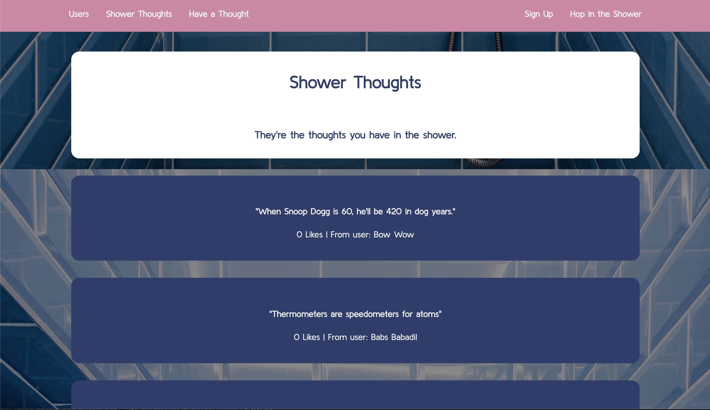

# Shower Thoughts

### A twitter-like social media site based on the subreddit of the same name.

## Technologies
- Ruby on Rails
- Rack
- ActiveRecord
- SQLite3

### Allowing the user to:
- Share their thoughts
- View other people's thoughts
- Follow other users
- Like and dislike other thoughts
- Edit and delete their thoughts

## Installation
- Clone this repository
- Open SQLite3
- From the project directory, run command: 
`bundle && rails db:create && rails db:migrate && rails db:seed && rails s

## Demo
### *[Video](https://www.youtube.com/watch?v=JR47A5nyjGI)*

